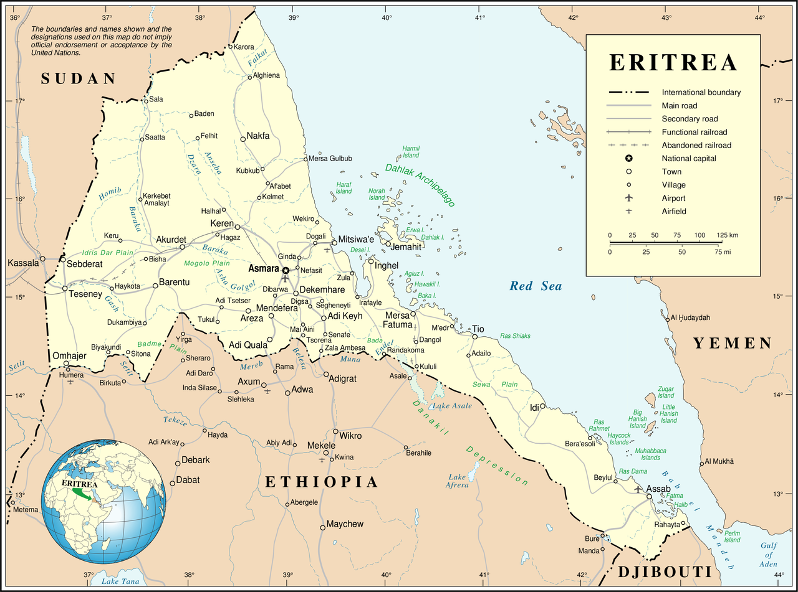

Eritrea
=======

### Country Analysis & Refugee Situation

[Kevin Ernst](mailto:ernstki%20-atsign-%20cchmc.org) /
[@ernstki](http://twitter.com/ernstki)

for Dr. Rodriguez's 16FS ANTH3065
* [bit.ly/anth3065-eritrea](https://bit.ly/anth3065-eritrea)
* [github.com/ernstki/anth3065-eritrea-slides](https://github.com/ernstki/anth3065-eritrea-slides)

Facts
=====

Small, fiercely independent presidential (socialist) republic on Red Sea

Name comes from ancient Greek *Erythra Thalassa* meaning "Red Sea"

source: [CIA World Fact
Book](https://www.cia.gov/library/publications/the-world-factbook/geos/er.html)

Facts (cont'd)
--------------

| Total area: | 117,600 sq km (≈ Pennsylvania)                           |
|-------------|----------------------------------------------------------|
| Borders:    | Djibouti, Red Sea (1,151 km), Ethiopia (1,033 km), Sudan |
| Population: | 5,869,869 (2016 est.)                                    |
| Industry:   | primarily agriculture; mining                            |

People & Culture
================

Home to nine recognized ethnic groups;
two majority ethnicities are Tigrinya 55%, Tigre 30%

Two predominant religions are Christianity and Islam
(roughly 50-50)

Official languages are Tigrinya and English

Architecture
============

### Many examples of Italian architecture in capital of Asmara

> In the 1930s, the city grew substantially as tens of thousands of
> Italians moved to the region in preparation for Mussolini’s planned
> invasion of Ethiopia. [...] Thousands of buildings were built in
> various styles, including Futurist, Novocento, Rationalist, and Art
> Deco [...]

Source: [World Monuments
Fund](https://www.wmf.org/project/asmara-historic-city-center)

Economy & Daily Life
--------------------

-   Mostly agrarian; most citizens do compulsory work for gov't
-   gold mining began to pick up in 2000s, but US sanctions hurt
    industry
-   Country is ~32% electrified; few (are allowed to) have telephones
-   Movement within the country requires special permits
-   "National service" compulsory; maintains militarized border between
    Eritrea/Ethiopia
-   Remittances from diaspora vital to economy

"National Service"
------------------

### Military compulsory for ages 18–40

Supposedly only 18 mo. duration; escapees report it can be indefinite.
Justification is defense against Ethiopia (US proxy).

-   UN report (June 2015) alleges virtual slavery, unpaid labor, sexual
    abuse and torture
-   majority of Eritreans flee to escape military service

Source: [Report of the Commission of Inquiry on Human Rights in
Eritrea](http://www.ohchr.org/EN/HRBodies/HRC/CoIEritrea/Pages/2016ReportCoIEritrea.aspx)

Colonial Control & Western Hegemony
-----------------------------------

Long controlled by colonial powers (Italy, GB), became an independent
nation in 1993 after a 30-year war with Ethiopia.

Southern border w/ Ethiopia a continual source of conflict, including a
war from 1998–2000 in which 20,000 Eritreans were killed and 1.5 million
displaced

Western Aid
===========

-   Eritrean government routinely denies UN inspectors
    -   recent UN report accuses regime of numerous human rights abuses

-   Yet they steadfastly resist pressure to "democratize" in return for
    UN aid
-   Accuses ICCt of enforcing "selective justice"
-   Accuses Western powers of pursuing "national interests camouflaged
    as humanitarian protection"

Attitude toward US
------------------

### Current generation proud of their fight for independence, intend to remain that way.

-   Very negative atitude toward US hegemony in Africa
-   Gov't believes US meddles in the region (Ethiopia) in order to
    maintain power over sea lanes
-   Believes root cause of extremism is interventionism

Governance
==========

Government was installed after 1991 independence; Isaias Afewerki first
and only president

People’s Front for Democracy and Justice (PFDJ) is sole political party

Constitution drafted in 1997 but never implemented

Geopolitics
===========

### Brutal Dictatorship or Triumph of Anticolonialism?

Western (UN) claims
-------------------

### "Africa's North Korea"

-   No participatory government
-   No real judicial system
    -   (extrajudicial killings, disappearances)

-   No freedom of press (only state-run media)
-   No freedom of movement for citizens
-   Human rights abuses in prisons &amp; national service
-   Gov't supports al-Shabaab terrorist group
-   Does not cooperate with "international community"

Eritrean Gov't Claims
---------------------

-   standing strong against neo-colonialism
-   UN assessment is part of a smear campaign
-   deny allegations of widespread human rights abuses
-   outside aid cripples developing nations; don't want it
-   country is struggling, but takes much better care of its people than
    neighbors (evidence)
-   say they will welcome repatriated refugees with no penalties (no
    more "shoot on sight")

Refugees
========

| Total:                    | 411,342 |
|---------------------------|---------|
| Refugees:                 | 379,766 |
| "Refugee-like situation": | 31,576  |
| UNHCR-assisted:           | 263,139 |
| Asylum-seekers (pending): | 63,446  |

Eritrea ranks 4th highest in Mediterranean arrivals in 2014–2015

[UNHCR Global Trends
2015](http://www.unhcr.org/en-us/statistics/unhcrstats/576408cd7/unhcr-global-trends-2015.html)

Refugees (cont'd)
-----------------

Most refugees take the overland route through Sudan, Libya, then to
Lampedusa in the Mediterranean

Refugees (cont'd)
-----------------

Refugees (cont'd)
-----------------

Since late 90s, nearly 5% of population has fled to neighboring
countries and Europe (pop. ~6 million)

-   causes economic harm to those who stay
-   if regime's claims are true, most economic migrants
-   if UN report true, they're escaping a brutal dictatorship

Repatriation
============

In the late 90s and 2000s, Eritria was seen as prime candidate for
UNHCR's 4R program (Repatriation, Reintegration, Rehabilitation and
Reconstruction)

-   UN aid response to border war was prompt
-   Sudanese were friendly and helpful to displaced Eritreans
-   35,000 immed. volunteered to be repatriated after conflict ended

Source:
[UNHCR](http://www.unhcr.org/en-us/news/latest/2004/3/405083e71/eritrea-receives-years-biggest-group-returnees.html)

Durable Solution?
-----------------

### Repatriation while cooperating with Eritrean gov't to address HR issues

UNHCR current challenge is to get Eritrea gov't to allow inspectors into
the country, while not beating them over the head with democritization
efforts

Credits
=======

### Images

-   Flickr user [gingerbrew](https://www.flickr.com/photos/gingerbrew)
    (Joseph Bautista)
-   Flickr user [David
    Stanley](https://www.flickr.com/photos/davidstanleytravel/)
-   Flickr User [Eric
    Lafforgue](https://www.flickr.com/photos/mytripsmypics/)
-   Pixabay user [tpsdave](https://pixabay.com/en/users/tpsdave-12019/)
-   [Wikimedia Commons](https://commons.wikimedia.org/wiki/Main_Page)

Links
=====

-   [CIA World Fact Book -
    Eritrea](https://www.cia.gov/library/publications/the-world-factbook/geos/er.html)
-   [Report of the commission of inquiry on human rights in
    Eritrea](https://documents-dds-ny.un.org/doc/UNDOC/GEN/G15/114/50/PDF/G1511450.pdf?OpenElement)
    (UNGA)

THE END
=======

### Thanks for your kind attention.

### …and here's a fluffy kitten:

